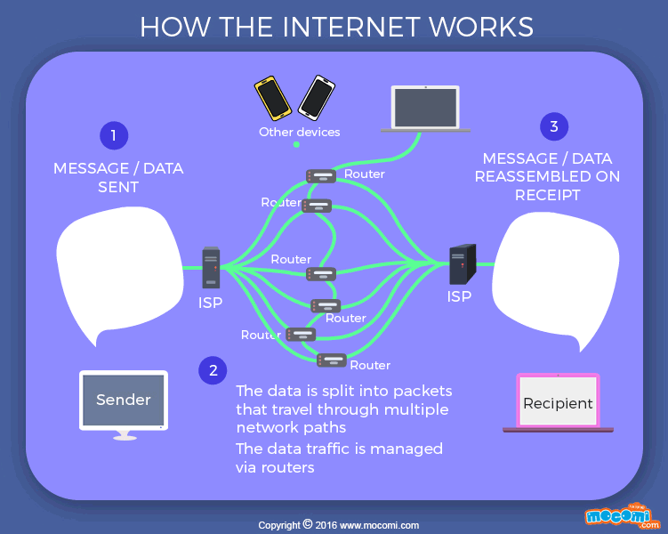

# How Internet Works

# REST alternatives

## GraphQL APIs.

## Falcor APIs.

## gRPC APIs.

## JSON-Pure APIs.

## oData APIs.

For normal package transfer in APIs, TCP/IP is used i.e., for transporting data. For live video streaming and voice calls RTP is used. For web access http/https is used.

Types of APIs other than REST are:

SOAP
JSON RPC and XML RPC
